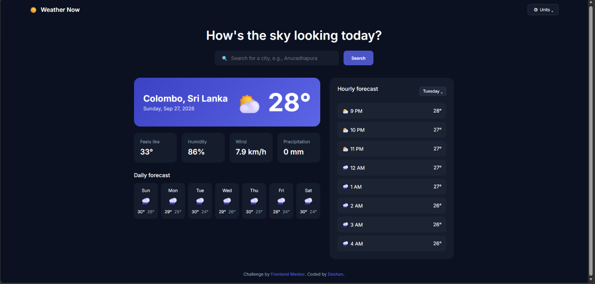

# Frontend Mentor - Weather app solution

This is a solution to the [Weather app challenge on Frontend Mentor](https://www.frontendmentor.io/challenges/weather-app-K1FhddVm49). Frontend Mentor challenges help you improve your coding skills by building realistic projects. 

## Table of contents

- [Overview](#overview)
  - [The challenge](#the-challenge)
  - [Screenshot](#screenshot)
  - [Links](#links)
- [My process](#my-process)
  - [Built with](#built-with)
  - [What I learned](#what-i-learned)
  - [Useful resources](#useful-resources)
  - [AI Collaboration](#ai-collaboration)
- [Author](#author)

## Overview

### The challenge

Users should be able to:

- Search for weather information by entering a location in the search bar
- View current weather conditions including temperature, weather icon, and location details
- See additional weather metrics like "feels like" temperature, humidity percentage, wind speed, and precipitation amounts
- Browse a 7-day weather forecast with daily high/low temperatures and weather icons
- View an hourly forecast showing temperature changes throughout the day
- Switch between different days of the week using the day selector in the hourly forecast section
- Toggle between Imperial and Metric measurement units via the units dropdown 
- Switch between specific temperature units (Celsius and Fahrenheit) and measurement units for wind speed (km/h and mph) and precipitation (millimeters) via the units dropdown
- View the optimal layout for the interface depending on their device's screen size
- See hover and focus states for all interactive elements on the page

### Screenshot



### Links

- Solution URL: [https://github.com/Deshan-D/weather-app](https://github.com/Deshan-D/weather-app)
- Live Site URL: [[Add Vercel live site URL here](https://weather-app-deshan6.vercel.app/)]

## My process

### Built with

- Semantic HTML5 markup
- CSS custom properties
- Flexbox
- CSS Grid
- Vanilla JavaScript (ES6+)
- [Open-Meteo API](https://open-meteo.com/) - For real-time weather and geocoding data

### What I learned

Working on this project reinforced my knowledge of asynchronous JavaScript and RESTful API integration. I learned how to chain multiple API requests effectively—first converting a city name to geographical coordinates using a Geocoding API, and then fetching comprehensive weather data based on those specific coordinates.

```js
const geoResponse = await fetch(`[https://geocoding-api.open-meteo.com/v1/search?name=$](https://geocoding-api.open-meteo.com/v1/search?name=$){city}&count=1&language=en&format=json`);
const geoData = await geoResponse.json();